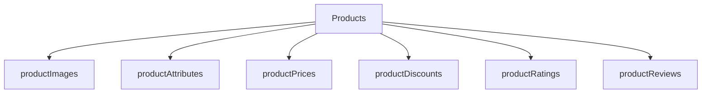

# api.werstack

REST API и Data Base.

## Структура базы данных

    
### Поля схемы `Users`

Поле | Описание
-----|------------
firstName | Обязательное поле типа **string**, с длинной строки от 2 до 15 символов.
secondName | Поле типа **string**, с длинной строки от 2 до 30 символов.
email | Обязательное поле типа **string**. Валидируется на уровне схемы на соответствие типу элекстронной почты.
password | Обязательное поле типа **string**. Поле хешируется. База данных не возвращает это поле.
shippingAddress | Поле типа **string**.
phoneNumber | Поле типа **string**.
role | Обязательное поле типа **string**, может принимать одно из трёх значений - **admin**, **seller**, **buyer**.

### Поля схемы `Sellers`

Поле | Описание
-----|------------
